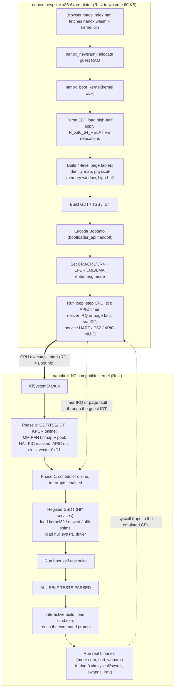

# nanokrnl

### *The end of an era.*

> Many of us started 20 or 30 years ago with low-level programming, emulation,
> reverse engineering, and disassembly. A nano Windows kernel booting through a
> hand-built emulator in the browser is full circle: it closes that era as a new
> one begins.

An **NT-compatible kernel written in Rust**: the architecture, abstractions,
and (where it matters) the exact constants and layouts of the Windows NT kernel,
rebuilt as a modern, memory-safe, freestanding Rust codebase. It boots on
x86-64, runs **real, unmodified Microsoft user binaries** (`cmd.exe`,
`more.com`, …) on its own NT syscalls, loads a genuine `null.sys` PE driver, and
proves itself with a self-test suite on every boot.

It runs natively under QEMU **and in your browser**, via **nanox**, a bespoke
~60 KB x86-64 WebAssembly emulator that boots the unmodified kernel image
directly in long mode, with no threads, no `SharedArrayBuffer`, and no
COOP/COEP headers.

> The project is **nanokrnl**; internally the kernel still identifies as
> `ntoskrnl-rs`, so the boot banner prints `ntoskrnl-rs 0.1.0`.

```
ntoskrnl-rs 0.1.0 (x86_64) — NT-compatible kernel in Rust
KiSystemStartup: phase 0
KE: GDT/TSS/IDT loaded (NT selector layout), KPCR online
MM: PFN bitmap @ 0x... — 118 MiB usable RAM
HAL: PIC masked, APIC enabled, clock on vector 0xD1 (CLOCK_LEVEL)
KiSystemStartup: phase 1
KE: scheduler online, interrupts enabled
KiSystemStartup: running self tests
  [ OK ] Mm: pool allocations succeed
  [ OK ] Ke: sync event wakes one waiter per set
  [ OK ] Io: IRP_MJ_WRITE to \Device\Null consumes all bytes
  ...
ALL SELF TESTS PASSED — system idle
```

## Run it in your browser

**Live demo:** the unmodified kernel boots in a web page, reaches a `C:\>`
prompt, and runs **real Microsoft binaries** typed at the keyboard: `ver`,
`echo`, `dir`, `whoami`, `more <file>`, `exit`. The page is served from
[`web/nanox/`](web/nanox/) on GitHub Pages: click **Boot**, wait for the
banner and self-tests to scroll past, and you get a working command prompt.

What makes this possible is **nanox** ([`emu/`](emu/)), a from-scratch
x86-64 emulator in Rust that compiles to a single ~60 KB `wasm32` module.
Unlike v86 (32-bit only) or qemu-wasm (multi-megabyte, needs
threads/`SharedArrayBuffer`/COOP-COEP), nanox doesn't emulate a PC from the
reset vector: because we control the bootloader, it **boots directly in long
mode** and emulates only the handful of devices the kernel actually touches
(16550 UART, Local APIC + timer, PS/2). The result serves from any plain
static file host, with no special headers.

Build and serve it yourself:

```sh
sh emu/build-wasm.sh                       # build nanox.wasm + stage the kernel
cd web/nanox && python3 -m http.server 8000   # http://localhost:8000
```

(Serve over HTTP, not `file://`; the demo's AudioWorklet backdrop needs a real
origin.)

## Architecture & boot sequence

Two pieces cooperate. **nanox** (the emulator) brings up a bare x86-64 machine
and hands control to **nanokrnl** (the kernel), which then boots itself the way
NT does, in phases. The flow below traces the whole path, from the web page
loading the wasm to a ring-3 program running on the kernel's own syscalls.



## What "NT-compatible" means here

The point is fidelity to NT's *kernel architecture*, not binary compatibility
with Windows drivers (yet). Concretely:

**Bit-exact where it's ABI.**
- `NTSTATUS` values (`STATUS_ACCESS_VIOLATION == 0xC0000005`, …) and the
  `NT_SUCCESS` severity rules (`kernel/src/rtl/status.rs`)
- `LIST_ENTRY` two-pointer layout and `CONTAINING_RECORD` recovery
  (`kernel/src/rtl/list.rs`)
- `UNICODE_STRING` (byte counts, UTF-16 buffer, 16-byte x64 layout)
  (`kernel/src/rtl/string.rs`)
- The x64 GDT **selector layout** (`KGDT64_R0_CODE = 0x10` … `KGDT64_SYS_TSS =
  0x40`), chosen by NT so `syscall`/`sysret` work (`kernel/src/ke/gdt.rs`)
- The IRQL model and its hardware mapping: IRQL **is** CR8/TPR, an interrupt is
  delivered iff `vector >> 4 > IRQL`, and the clock runs on **vector 0xD1**
  (`CLOCK_LEVEL` 13), same as NT x64 (`kernel/src/ke/irql.rs`)
- Pool tags, `IRP_MJ_*` codes, stop codes (`IRQL_NOT_LESS_OR_EQUAL`, …)

**Faithful in shape where bit-compat doesn't matter.**
Dispatcher objects with a common header and one wait API; DPCs queued from ISRs
and retired at `DISPATCH_LEVEL`; the dispatcher lock handed off across context
switches; driver/device/IRP triangle with dispatch tables; tagged pool with a
16-byte header; bugchecks that freeze the world.

**Modern & safe by construction.**
`unsafe` is concentrated at the hardware boundary and in the intrusive data
structures, each block with an explicit safety contract. `SpinLock<T>` *owns*
its data and raises IRQL by construction, so the classic "touched shared state
below `DISPATCH_LEVEL`" driver bug doesn't compile. `Box`/`Vec`/`String` work
in-kernel and draw from NonPagedPool with the `'Rust'` tag.

## Subsystem map

| Directory | NT analog | Contents |
|---|---|---|
| `kernel/src/rtl/` | `Rtl*` | NTSTATUS, intrusive lists, UNICODE_STRING, run-finding bitmap |
| `kernel/src/ke/` | `Ke*`/`Ki*` | IRQL, spinlocks, GDT/IDT/TSS, traps, KPCR/KPRCB, dispatcher objects, DPCs, threads, scheduler, syscalls, bugcheck |
| `kernel/src/mm/` | `Mm*` | PFN allocator, NonPagedPool + global allocator, page-table walker, per-process address spaces |
| `kernel/src/ex/` | `Ex*` | `ExAllocatePoolWithTag` API surface |
| `kernel/src/ob/` | `Ob*` | Object headers, types, reference counting, handle table |
| `kernel/src/ps/` | `Ps*` | ETHREAD, `PsCreateSystemThread`, process creation |
| `kernel/src/io/` | `Io*` | DRIVER/DEVICE/IRP, `IoCallDriver`, console device, RAM filesystem, `null.sys` |
| `kernel/src/ldr/` | `MiLoadSystemImage`/`Iop*` | PE/COFF loader, kernel export table, user-mode loader, ntdll/MUI |
| `kernel/src/hal/` | HAL | 16550 serial, 8259 PIC masking, local APIC + clock |
| `kernel/src/init.rs` | `KiSystemStartup` | Phase 0/1 init + boot self tests |
| `ntabi/` | ntdef/wdm headers | Shared `#[repr(C)]` kernel⇄driver ABI |
| `driver/` | a WDK driver | Real PE test driver, built for `x86_64-pc-windows-msvc` |
| `kernel32/`, `msvcrt/` | Win32 / CRT | DLL shims that forward to the `Nt*` syscalls |
| `userapp/`, `userapp2/` | console apps | Bundled ring-3 PE programs |
| `boot/` | bootmgr/winload | Disk-image builder + QEMU runner (`bootloader` crate) |
| `emu/` | (none) | **nanox**, the browser x86-64 emulator |
| `web/nanox/` | (none) | the browser demo (GitHub Pages root) |

## Real binaries, real drivers, real ring 3

The user/kernel boundary is the genuine x64 Windows mechanism: `syscall`/`sysret`
with `STAR`/`LSTAR`/`FMASK` against the NT selector layout, `swapgs`, an SSDT
dispatch, and `iretq` to ring 3. On top of it:

- **Unmodified Microsoft binaries.** An off-the-shelf `cmd.exe` loads via the
  user-mode PE loader, binds its `KERNEL32`/`msvcrt`/`ntdll` imports to in-tree
  shim DLLs (real cross-module dynamic linking against parsed PE export tables),
  runs the real MSVC CRT startup with a per-thread TEB reached via `gs:`, and
  reaches an interactive `C:\>` prompt. From it: `echo`, `dir`, `where`, `sort`,
  `choice`, `whoami` (`nanokrnl\user`), `more <file>`, `exit`.
- **Genuine PE/COFF drivers.** The loader maps a real `.sys` image built by the
  Windows toolchain, applies base relocations, binds its imports against the
  kernel's `ntoskrnl.exe` export table, and runs `DriverEntry` — `null.sys`
  services IRPs end to end.
- **Supporting subsystems.** A RAM filesystem reached through the normal
  `NtCreateFile`/`NtReadFile` path, MUI string resolution (`<exe>.mui`
  side-by-side resources), per-process command lines, per-process address spaces
  with CR3 switching, SMEP + SMAP, and `ProbeForRead`/`ProbeForWrite` on every
  user buffer.

Every boot runs a self-test suite end to end (67 checks → `ALL SELF TESTS
PASSED`), exercising pool, the dispatcher, IRPs, the loaded driver, and ring-3
processes.

## Build & run

Prereqs: Rust via rustup (`rust-toolchain.toml` pins the toolchain and the
`x86_64-unknown-none` target; the boot-image builder needs a nightly with
`rust-src`/`llvm-tools`) and `qemu-system-x86_64`.

**Native (QEMU) — the interactive shell on the serial console:**

```sh
sh scripts/run-interactive.sh
```

`scripts/qemu-test.sh` runs the headless boot self-tests instead (exit **33** =
all passed, **3** = a test failed or the kernel bugchecked).

**Browser (nanox):**

```sh
sh emu/build-wasm.sh
cd web/nanox && python3 -m http.server 8000   # open http://localhost:8000
```

To work on the emulator itself, see [`emu/README.md`](emu/README.md):
`cargo test` for the decoder/MMU/devices, `cargo run --release --example
inspect_kernel` to boot the kernel natively, and the differential-testing
oracles (`conformance` against iced-x86, `diff_unicorn` against Unicorn).

## Write-ups & specs

- **A Windows Kernel in a Browser Tab, Part I: Cold Boot, Fast Boot, and Four
  Megabytes**: https://www.msuiche.com/posts/nanokrnl-cold-boot-fast-boot/
- **Part II: A Filesystem Over 9P, From a JavaScript Object**:
  https://www.msuiche.com/posts/nanokrnl-9p-host-filesystem/
- **Running Unmodified Microsoft Console Tools**:
  https://www.msuiche.com/posts/nanokrnl-windows-console-tools/
- **Part III: Debugging It, and the Crash Dumps It Writes Itself** (lldb, the ELF
  core, and the native MEMORY.DMP WinDbg opens):
  https://www.msuiche.com/posts/nanokrnl-debugging-crash-dump/
- **Fable 5: building a Windows kernel in Rust, Part I**:
  https://www.msuiche.com/posts/fable-5-windows-kernel/
- **Part II**:
  https://www.msuiche.com/posts/fable-5-windows-kernel-part-2/
- **nanox design & verification**: [`emu/SPEC.md`](emu/SPEC.md) and
  [`emu/README.md`](emu/README.md)
- **The browser journey** (v86 → qemu-wasm → nanox, plus the shared-ulib CRT
  bug): [`WORKLOG.md`](WORKLOG.md)

## Credits

By Matt Suiche ([@msuiche](https://twitter.com/msuiche)), Fable 5, and Opus 4.8.

A tip of the hat to **[Fabrice Bellard](https://bellard.org/)** — QEMU and
TinyEMU were the inspiration for `nanox`, and QEMU's CPU core (via
[Unicorn](https://www.unicorn-engine.org/)) is the differential-testing oracle
that keeps the emulator honest.
