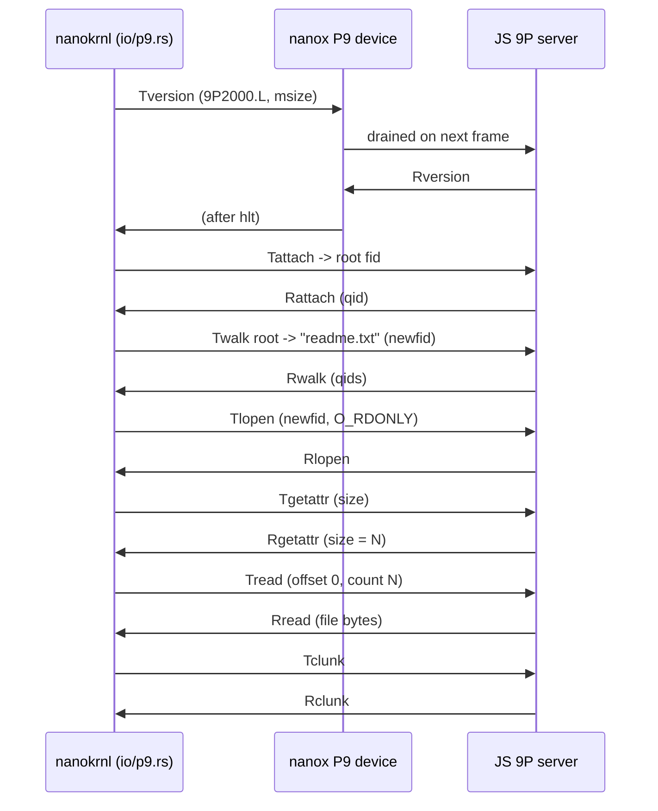

# Sketch: a 9P (v9fs-style) host filesystem for nanokrnl over nanox

**Status: design sketch, not yet built.** This is the blueprint for sharing the
*host's* files into the guest the way QEMU's virtfs does, but with a
browser-shaped transport instead of virtio-pci.

Today nanokrnl reaches files through an in-kernel RAM filesystem baked into the
image. 9P lets us instead point a path like `\\host\readme.txt` at a **9P server
running in JavaScript**, so the browser (or a real host) can serve live files to
`cmd.exe` / `more.com` without rebuilding the kernel. The kernel becomes a 9P
client (the role Linux's v9fs plays); nanox carries the bytes; JS is the server.

We target **9P2000.L** (the Linux dialect): its messages map cleanly onto the
operations the kernel already needs (`walk`, `open`, `read`, `getattr`).

```
  guest (ring 0)                 nanox (emulator)              host (JS)
  +----------------+   MMIO      +-----------------+  buffer    +-----------+
  | io/p9.rs       |  doorbell   | P9 device       |  in guest  | 9P server |
  | 9P client      | ----------> | (req/resp ring) | ---------> | over a    |
  | build Tmsg     |             | run loop        |            | backing   |
  | parse Rmsg     | <---------- | services p9     | <--------- | store     |
  +----------------+   response  +-----------------+            +-----------+
```

## 1. Transport: a tiny "p9" device in nanox

The lowest-friction transport reuses the pattern the UART already uses (a device
with byte FIFOs the host drains/fills). 9P is self-framing (every message starts
with a 4-byte little-endian `size`), so a byte stream is enough.

`emu/src/devices.rs`:

```rust
/// Host filesystem transport. The guest writes a framed 9P T-message to `tx`;
/// the host (JS) drains it, serves it, and pushes the R-message into `rx`.
#[derive(Default)]
pub struct P9 {
    pub tx: alloc::collections::VecDeque<u8>,  // guest -> host (requests)
    pub rx: alloc::collections::VecDeque<u8>,  // host -> guest (responses)
}
```

Expose it through MMIO at a fixed page nanox already special-cases (like the APIC
at `0xFEE0_0000`). Two registers are enough for a byte-stream:

`emu/src/machine.rs` (in the MMIO read/write path):

```rust
const P9_BASE: u64 = 0xFED0_0000;
// +0x00 DATA   : write a byte -> tx;  read -> next rx byte (0 if empty)
// +0x04 STATUS : read bit0 = rx has data, bit1 = tx drained/ack
```

### The host side of the device (wasm ABI)

`emu/src/wasm.rs`, mirroring `nanox_uart_read` / `nanox_uart_write`:

```rust
#[no_mangle] pub extern "C" fn nanox_p9_read() -> i32 { /* pop dev.p9.tx, or -1 */ }
#[no_mangle] pub extern "C" fn nanox_p9_write(b: u8) {  /* dev.p9.rx.push_back(b) */ }
#[no_mangle] pub extern "C" fn nanox_p9_tx_len() -> u32 { /* dev.p9.tx.len() */ }
```

### Sync vs async (the one real design decision)

A 9P RPC is "send request, block for reply", but JS only runs when the emulator
yields. Two ways to bridge that:

- **(A) Cooperative, no new wasm imports (recommended first cut).** The client
  writes the request, then executes `hlt`. nanox's run loop already returns to
  JS on `hlt`; the JS server then drains `nanox_p9_read()`, serves the message,
  pushes the reply with `nanox_p9_write()`, and injects an IRQ (or the guest just
  polls STATUS after the `hlt`). Latency is about one frame per RPC, which is
  fine for interactive file access, and it keeps nanox import-free. It also
  supports **async** host backends (the File System Access API, `fetch`) because
  the server can take as many frames as it needs before pushing the reply.
- **(B) Synchronous import.** Add one imported function `p9_serve(reqOff, len,
  respOff, cap) -> respLen` that nanox calls during the doorbell MMIO write; JS
  reads/writes guest RAM directly through `e.memory.buffer` and returns
  immediately. Lowest latency, but only works with a synchronous backing store
  (an in-memory object), and it breaks the "no imports" property.

Start with (A).

## 2. The host: a 9P2000.L server in JavaScript

A few hundred lines. State is a map of `fid -> node`, where a node is a path into
a backing store.

### Where the bytes actually come from (the browser question)

A web page has no access to the host disk; it can only read what the browser
sandbox allows. The 9P server's `backing` is therefore one of these sources, all
behind the same `{stat, readdir, read, write}` interface:

| Source | What it can reach | R/W | Needs | Support | Sync? |
|---|---|---|---|---|---|
| **`fetch`** of bundled files | files committed under `web/nanox/` (the site) | read | nothing | all | async |
| **In-memory object** | a JS object you populate at load | read/write (session) | nothing | all | sync |
| **`<input type=file>` / drag-drop** | files/folders the user picks or drops | read | a click | all | async |
| **File System Access API** (`showDirectoryPicker`) | a real host folder the user grants | read/write | a click + permission | Chromium | async |
| **OPFS** (`navigator.storage.getDirectory`) | a private, persistent, origin-scoped store | read/write | nothing | most | sync in a Worker |

So the honest picture:

- **Demo, zero friction:** back the server with `fetch`. The "host" folder is just
  files shipped in the site (the same mechanism that already loads `kernel.bin`
  and `tracks/`). Read only, works on GitHub Pages, no prompts. `more \\host\x`
  fetches `web/nanox/hostfs/x`.
- **The user's real files:** the **File System Access API**. On a click the user
  picks a folder; the server then reads (and, with permission, writes) the real
  files in it. This is the only path to the actual disk, and it is Chromium-only
  and gated by a permission prompt.
- **User-selected, any browser:** `<input type=file webkitdirectory>` or
  drag-and-drop gives `File` objects you read with `.arrayBuffer()`.
- **Persistent scratch disk:** OPFS. Not the user's Documents folder, but a real
  filesystem the origin owns, and it survives reloads.

Every option except the in-memory object (and OPFS sync handles inside a Worker)
is **asynchronous**, which is exactly why the transport in section 1 is the
cooperative/yield design: the server can take several frames to resolve a
`read()` before pushing the `Rread`.

The backing store is pluggable; the demo would ship the `fetch` one and offer a
"Mount a folder" button that swaps in the File System Access backend.

`web/nanox/p9-server.js` (shape):

```js
export function createP9Server(backing) {        // backing: {stat, readdir, read}
  const fids = new Map();                          // fid -> { path }
  let inbuf = new Uint8Array(0);

  // Called by the page each frame: drain the device, serve any complete message.
  function pump(e) {
    let b; const bytes = [];
    while ((b = e.nanox_p9_read()) >= 0) bytes.push(b);
    inbuf = concat(inbuf, bytes);
    while (inbuf.length >= 4) {
      const size = u32(inbuf, 0);
      if (inbuf.length < size) break;              // wait for the rest
      const reply = serve(inbuf.subarray(0, size), backing, fids);
      for (const x of reply) e.nanox_p9_write(x);
      inbuf = inbuf.subarray(size);
    }
  }
  return { pump };
}
```

`serve()` switches on the T-message type and builds the matching R-message:

| T-message        | what it does                              | R-message      |
|------------------|-------------------------------------------|----------------|
| `Tversion`       | negotiate `9P2000.L`, msize              | `Rversion`     |
| `Tattach`        | root fid -> "/"                           | `Rattach` qid  |
| `Twalk`          | resolve names, clone fid                  | `Rwalk` qids   |
| `Tlopen`         | open fid                                  | `Rlopen`       |
| `Tgetattr`       | size, mode, mtime                         | `Rgetattr`     |
| `Treaddir`       | directory entries                         | `Rreaddir`     |
| `Tread`          | bytes at offset                           | `Rread`        |
| `Tclunk`         | drop fid                                   | `Rclunk`       |

The page calls `p9.pump(e)` right after `m.run()` returns in the existing loop,
the same place it already drains the UART.

## 3. The guest: a 9P client in the kernel

`kernel/src/io/p9.rs`. Three parts: MMIO byte I/O, an RPC helper, and message
builders/parsers.

```rust
const P9_DATA:   u64 = 0xFFFF_FF00_FED0_0000;       // via the phys-memory window
const P9_STATUS: u64 = 0xFFFF_FF00_FED0_0004;

/// One synchronous RPC: write the framed T-message, yield, read the R-message.
fn p9_rpc(req: &[u8], resp: &mut [u8]) -> usize {
    for &b in req { mmio_w8(P9_DATA, b); }          // size-prefixed already
    while mmio_r8(P9_STATUS) & 1 == 0 { hlt(); }    // (A): yield to the host
    let size = read_u32_from_device();              // first 4 bytes of the reply
    for i in 0..size { resp[i] = mmio_r8(P9_DATA); }
    size
}
```

Message builders are just little-endian packing (9P has no alignment or padding):

```rust
// Tversion(tag=NOTAG, msize=8192, version="9P2000.L")
// Tattach(tag, fid=root, afid=NOFID, uname="", aname="", n_uname=0)
// Twalk(tag, fid, newfid, [name, ...]) -> qids
// Tlopen(tag, fid, flags=O_RDONLY) ; Tread(tag, fid, offset, count) -> data
```

A convenience wrapper the rest of the kernel can call:

```rust
/// Read a whole host file by path, e.g. p9_read("/readme.txt").
pub fn p9_read(path: &str) -> Result<alloc::vec::Vec<u8>, NtStatus> {
    p9_version()?;                                  // once, at init
    let root = p9_attach()?;                        // fid 0 -> "/"
    let fid  = p9_walk(root, path.split('/'))?;     // clone + walk
    p9_lopen(fid, O_RDONLY)?;
    let len  = p9_getattr(fid)?.size;
    let data = p9_read_all(fid, len)?;              // loop Tread until len
    p9_clunk(fid)?;
    Ok(data)
}
```

### Hooking it into the existing file path

The smallest integration: route a reserved prefix to 9P inside the file-open
syscall. In `kernel/src/syscalls.rs::nt_create_file`, before the RAM-fs lookup:

```rust
if let Some(host) = path.strip_prefix("\\\\host\\") {
    let data = io::p9::p9_read(&to_unix(host))?;    // pull from the host
    return Ok(open_readonly_blob(data));            // a handle backed by `data`
}
```

So `more \\host\notes.txt` opens a file the JS server reads live, with no kernel
rebuild. Writes (`Twrite`) and `Treaddir` (so `dir \\host\` works) are the same
pattern in reverse.

## 4. Message flow for `more \\host\readme.txt`



## 5. Why this is a good fit

- **Small.** 9P2000.L needs only the handful of messages above; the server is a
  few hundred lines of JS and the client a few hundred of Rust. No block device,
  no on-disk filesystem format.
- **Live host files.** Back the server with the File System Access API and the
  browser demo can read (and write) a folder the user picks, served to real
  Microsoft binaries running in the kernel.
- **It is the v9fs model.** The kernel plays exactly the v9fs client role; nanox
  plays the virtio transport; JS plays the 9P server. The same shape QEMU uses
  for `-virtfs`, just over a browser transport.

## 6. Build order

1. `P9` device + MMIO + `nanox_p9_*` ABI in nanox; a loopback test (echo).
2. JS server with an in-memory backing store; serve `Tversion`/`Tattach`.
3. Kernel client: `p9_version`/`attach`/`walk`/`lopen`/`getattr`/`read`.
4. `p9_read()` end to end; a boot self-test that reads a known host file.
5. Wire `\\host\` into `nt_create_file`; try `more \\host\readme.txt`.
6. Add `Twrite` + `Treaddir`; swap the in-memory backing for File System Access.
