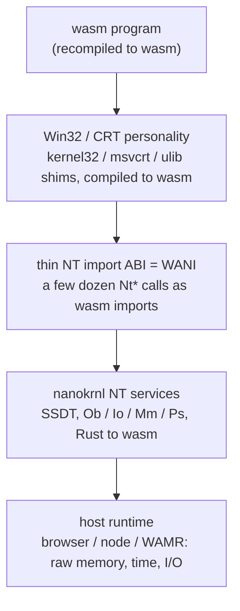

# Sketch: WANI, a WebAssembly NT Interface for nanokrnl

**Status: design sketch, not yet built.** This is the blueprint for running
programs *recompiled to wasm* directly on nanokrnl's `Nt*` services, the way
WALI runs programs on a host Linux kernel, but with one box swapped: because
there is no Windows kernel underneath to pass through to, nanokrnl itself
(compiled to wasm) *is* the kernel underneath.

Today nanokrnl runs unmodified Microsoft binaries by emulating x86 (nanox). That
is great for compatibility and the "real `cmd.exe`" demo, but it is slow and it
carries a whole instruction interpreter. WANI is the complementary path: a
program compiled straight to wasm, its NT syscall stubs turned into a few dozen
wasm imports, and nanokrnl serving those imports at near-native wasm speed.

The pitch in one sentence: **Linux has WALI; Windows has nothing, because Windows
has no open kernel to pass through to. nanokrnl is an open NT kernel in Rust that
compiles to wasm, so it can be the thin Windows kernel interface for WebAssembly.**

```
  wasm program (recompiled to wasm)
    -> Win32 / CRT personality      (kernel32 / msvcrt / ulib shims, to wasm)
      -> thin NT import ABI          (a few dozen Nt* calls as wasm imports) = WANI
        -> nanokrnl NT services      (Rust to wasm) = the part nobody else has
          -> host                    (browser / node / WAMR: memory, time, I/O)
```

## 1. Background: what WALI is

WALI ("Empowering WebAssembly with Thin Kernel Interfaces", EuroSys 2025) exposes
a kernel's userspace syscall layer to WebAssembly. A program is compiled to wasm
against a musl port (wali-musl) whose syscall stubs are not real `syscall`
instructions but **wasm imports**. At run time the WAMR runtime resolves each
import and translates it to the **host** kernel's syscalls. WALI shipped for
Linux and Zephyr.

The property that matters here is that WALI is a thin **passthrough**. There is a
real Linux (or Zephyr) kernel underneath, and WALI's job is only to marshal
arguments across the wasm boundary and forward the call. Nobody has to
*implement* `read`, `write`, `mmap`, or `clone`: the host already has them.

## 2. The insight: why Windows is different, and why nanokrnl is the unlock

Copy WALI's layering toward Windows and the passthrough assumption breaks.

In an agent sandbox, or a Firecracker / microVM style environment, there is **no
Windows kernel underneath** to pass through to. You cannot forward `NtCreateFile`
to a host NT the way WALI forwards `openat` to host Linux, because there is no
host NT. So a Windows thin interface *cannot* be a passthrough.

That means someone has to actually **implement** the NT services inside the
sandbox. That implementation is the entire hard part, and it is exactly the part
WALI never had to do (Linux was already there). It is also exactly what nanokrnl
already is: a from-scratch NT kernel in Rust, with a real SSDT and the Ob / Io /
Mm / Ps subsystems behind the `Nt*` syscalls (see the subsystem map in
[`README.md`](../README.md)), and it already compiles to wasm, since that is how
nanox boots it in the browser today.

So WANI is WALI's layering with one box swapped:

| Layer | Linux WALI | WANI |
|---|---|---|
| program | wasm, compiled against wali-musl | wasm, compiled against the Win32/CRT shims |
| syscall stubs | wasm imports | wasm imports |
| kernel underneath | **host Linux** (passthrough) | **nanokrnl compiled to wasm** (implemented) |
| runtime | WAMR | WAMR / node / browser |

The swap is the whole idea. Where Linux WALI calls the host kernel, WANI calls
nanokrnl, because there is no host NT to call.

## 3. The WANI layering



Each layer, top to bottom:

- **The wasm program.** Application code compiled to `wasm32` (or `wasm64` once
  memory64 is in play). It does not contain x86 at all: no PE, no emulation. It
  is the code you built, or the code an agent generated, targeting a wasm
  toolchain.
- **Win32 / CRT personality.** The existing `kernel32` / `msvcrt` / `ulib` shims
  that already forward to the `Nt*` syscalls (see the shim rows in the subsystem
  map), recompiled to wasm. This is the personality layer: it gives the program
  `WriteFile`, `CreateFileW`, `malloc`, `printf` and friends, and implements them
  on top of the thin NT ABI below. How much Win32 lives here is open-ended and
  driven by what target programs need.
- **Thin NT import ABI (WANI).** The narrow boundary: a few dozen `Nt*` calls
  declared as wasm imports. This is the defensible, specifiable surface, the
  analog of wali-musl's syscall stub set. It is small on purpose.
- **nanokrnl NT services.** nanokrnl compiled to wasm, serving those imports out
  of its real SSDT and its Ob / Io / Mm / Ps subsystems. This is the box WALI got
  from the host for free and the box nobody else has for Windows.
- **Host runtime.** The browser, node, or WAMR underneath nanokrnl, supplying raw
  linear memory, a clock, and byte I/O (console, and later a host filesystem such
  as the 9P transport sketched in [`9p-over-nanox.md`](9p-over-nanox.md)).

## 4. Two complementary execution models

nanox and WANI are not competitors; they sit at opposite ends of a tradeoff.

| | **nanox (x86 emulation)** | **WANI (thin interface)** |
|---|---|---|
| what runs | unmodified PE binaries | programs recompiled to wasm |
| how | interpret x86, trap `syscall` to the SSDT | call `Nt*` as wasm imports |
| source needed | none | yes (or an LLVM / PE-to-wasm path) |
| speed | slow (interpreter) | near-native wasm |
| isolation | the emulator sandbox | the wasm sandbox itself |
| ISA portability | x86-64 guest only | any wasm host |
| best at | compatibility, "real `cmd.exe`" demo | agent sandboxes, microVMs |

nanox is the compatibility path. It runs an off-the-shelf `cmd.exe` or `more.com`
with no source and no recompilation, because it interprets the actual x86 and
binds the PE's imports to the shim DLLs (this is what boots in the browser
today). The cost is interpreter speed and a whole instruction core.

WANI is the speed-and-portability path. The program is compiled to wasm ahead of
time, so there is no instruction interpreter in the loop: the wasm host runs the
program directly and nanokrnl services its `Nt*` imports. You get near-native
wasm speed, the wasm sandbox for isolation, and portability to any wasm runtime,
at the cost of needing the program's source (or a compiler path into wasm).

The same nanokrnl sits underneath both. In nanox it is reached through emulated
`syscall`; in WANI it is reached through wasm imports. The NT services do not
change.

## 5. The thin NT ABI

The boundary is a small set of `Nt*` calls declared as wasm imports. A
representative subset, enough to run a CRT program that opens files and threads:

| Import | NT service | Purpose |
|---|---|---|
| `NtCreateFile` | Io | open / create a file or device |
| `NtReadFile` | Io | read bytes at an offset |
| `NtWriteFile` | Io | write bytes at an offset |
| `NtClose` | Ob | close a handle |
| `NtAllocateVirtualMemory` | Mm | reserve / commit pages |
| `NtFreeVirtualMemory` | Mm | release pages |
| `NtCreateThread` | Ps | spawn a thread in this instance |
| `NtWaitForSingleObject` | Ke | block on a dispatcher object |

These map one-to-one onto services nanokrnl already dispatches through its SSDT.
The wasm boundary only changes *how the argument block arrives*: instead of the
x86 `syscall` convention (index in `eax`, args in registers, `NtStatus` back in
`eax`), the arguments cross as wasm import parameters, and pointer arguments are
offsets into the program's linear memory.

### Import signatures

An import is declared once and resolved by the runtime. In WAT-ish shape:

```wat
(import "nt" "NtWriteFile"
  (func $NtWriteFile
    (param i32   ;; handle
           i32   ;; io_status_block  (offset into linear memory)
           i32   ;; buffer           (offset into linear memory)
           i32)  ;; length
    (result i32)));; NTSTATUS
```

On the Rust side, nanokrnl exposes the matching export. It reads the buffer
straight out of the program's linear memory (the host hands it the base pointer),
runs the same `NtWriteFile` path the SSDT would, and returns the `NTSTATUS`:

```rust
/// Exposed to the wasm program as the "nt"."NtWriteFile" import.
/// `buf` / `iosb` are offsets into the program's linear memory.
#[no_mangle]
pub extern "C" fn wani_NtWriteFile(
    handle: u32,
    iosb: u32,
    buf: u32,
    len: u32,
) -> i32 {
    let bytes = linmem_slice(buf, len);          // borrow from linear memory
    let st = io::nt_write_file(handle.into(), bytes);  // the existing Io path
    write_io_status(iosb, st, bytes.len());
    st.as_i32()
}
```

### A wasm program calling it

No emulation anywhere in this path: the program is wasm, the call is an import,
nanokrnl runs the service.

```rust
// A hand-written wasm program (before any CRT), talking straight to WANI.
extern "C" {
    fn NtWriteFile(handle: u32, iosb: u32, buf: u32, len: u32) -> i32;
}

fn main() {
    let msg = b"hello from wasm on nanokrnl\n";
    let mut iosb = [0u8; 16];
    unsafe {
        NtWriteFile(
            STDOUT_HANDLE,
            iosb.as_mut_ptr() as u32,
            msg.as_ptr() as u32,
            msg.len() as u32,
        );
    }
}
```

The Win32/CRT layer (section 3) sits between a normal program and these imports,
so most code calls `WriteFile` or `printf` and never names an `Nt*` function, the
same way a Linux WALI program calls libc, not raw syscall stubs.

## 6. Limitations (read this section)

WANI has a hard, inherent scope limit, and it is important to state it plainly
rather than bury it.

- **WANI only runs programs you can recompile to wasm.** It cannot run existing
  closed-source `.exe` files. There is no x86 in the WANI path, so a binary you
  only have as a PE is out of reach. WANI is therefore **not** a Windows
  compatibility layer for the app ecosystem. It is a sandboxed, portable,
  near-native runtime with an NT/Win32 personality, for code you build or an agent
  generates.
- **This is the same scope as Linux WALI, not a smaller one.** Linux WALI also
  only runs programs recompiled to wasm against wali-musl; it does not run
  arbitrary existing ELF binaries either. So the Windows version has exactly the
  scope of the Linux version. WANI is not handicapped relative to WALI; it simply
  inherits WALI's model.
- **Running unmodified PEs at wasm speed would need an x86-to-wasm JIT /
  dynarec**, which is a large, separate project. Until that exists, nanox
  (emulation) remains the compatibility path, and the two live side by side.
- **The defensible surface is small and open-ended in one direction.** The
  interesting boundary is the thin NT syscall set (a few dozen `Nt*` calls),
  which is small and specifiable. Above it, how much Win32 the shims implement is
  open-ended and should be prioritized by what the target programs actually call.
- **Threads / processes / handles inside one wasm instance mostly reuse what
  exists.** nanokrnl already has Ps, Ob, and a scheduler; the work is largely
  "compile it to wasm and expose it through WANI", not new kernel design. The
  genuinely new design questions are at the edges: how many wasm instances map to
  a process, and how the host clock and I/O reach Mm/Io.

## 7. Why it matters

Agent sandboxes and microVM platforms (Firecracker and similar) are effectively
**Linux-only** today. If an agent needs an isolated place to run generated code,
it gets a Linux userland. There is no equivalent for a program that wants an
NT / Win32 personality, because there is no open Windows kernel to put in the
sandbox and no host NT to pass through to.

WANI fills that gap. It gives generated or hand-built code a real NT syscall
surface and a Win32 personality, running at wasm speed inside a wasm sandbox,
portable to any wasm host, with no proprietary kernel involved. That is precisely
the shape agent sandboxes and microVMs already use for Linux, extended to
Windows for the first time, and it is possible only because nanokrnl supplies the
kernel box that WALI got from Linux for free.

## 8. Build order

Each step is runnable on its own and does not require the next.

1. **Expose 2 or 3 `Nt*` calls as wasm imports.** Start with `NtWriteFile`,
   `NtAllocateVirtualMemory`, `NtClose`. Wire them to the existing SSDT paths,
   translating pointer arguments as linear-memory offsets.
2. **Run a hand-written wasm program with no emulation.** The section 5 program:
   it calls `NtWriteFile` as an import and prints to the console. This proves the
   boundary end to end with nanokrnl as the kernel underneath, and no nanox in the
   loop.
3. **Recompile the CRT hello.** Compile a minimal `msvcrt` / `ulib` slice to wasm
   so a program can call `printf` and have it reach `NtWriteFile` through the
   personality layer. This is the "recompiled hello world" milestone, the WANI
   analog of a wali-musl hello.
4. **Files.** Add `NtCreateFile` / `NtReadFile` over the RAM filesystem (and,
   later, the 9P host filesystem), so a wasm program can open, read, and write a
   file through the normal Io path.
5. **Threads and waits.** Expose `NtCreateThread` and `NtWaitForSingleObject` so a
   single wasm instance can spawn a thread on nanokrnl's Ps/scheduler and block on
   a dispatcher object, reusing the existing Ke wait machinery.
6. **Grow the Win32 personality by demand.** Add shim coverage as target programs
   need it, keeping the thin NT boundary fixed and small while the Win32 surface
   above it fills in.

Prior art in this repo: the git history contains a reverted "bespoke WASM port"
that already compiled kernel subsystems to wasm. The thin-interface framing gives
that work a clean boundary (the NT import ABI) and a concrete reason to exist (be
the kernel WALI cannot get from a host on Windows).
